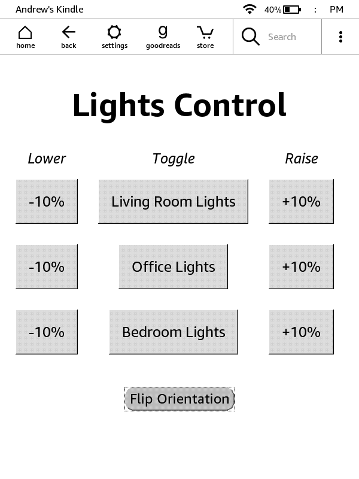

# kindleLightsWebApp
A WAF (Web Application Framework) meant to run though Mesquito on Kindles to control smartlights in the most convoluted way possible

Takes advantage of [Home Assistant](https://www.home-assistant.io/) webhooks to run a web app through [Mesquito](https://github.com/KindleModding/Mesquito)
and allow me to use my kindle as a remote control for the lights in my house.

 

Two recommendations if you plan to use this yourself:
 * Use the 'Flip Orientation' button to use the app with your Kindle upside down and have easy access to the charging port for uninterrupted use
 * Use the search command `~ds` in the search bar on your Kindle's home screen in order to disable the screensaver
    * Note that this _will_ kill your battery quickly, highly recommend keeping it charged at all times or just letting it go to screensaver mode and waking when needed
